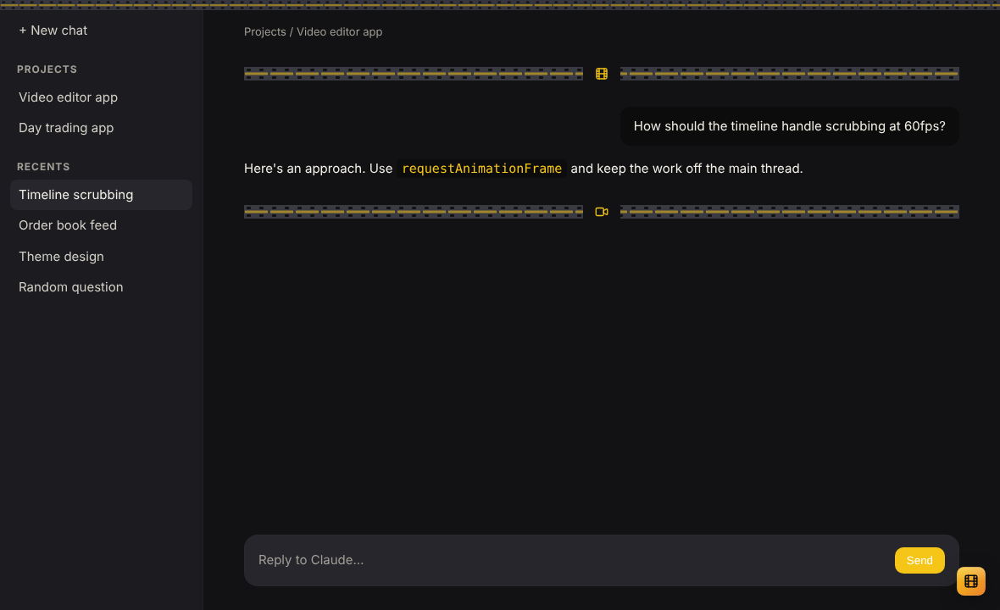
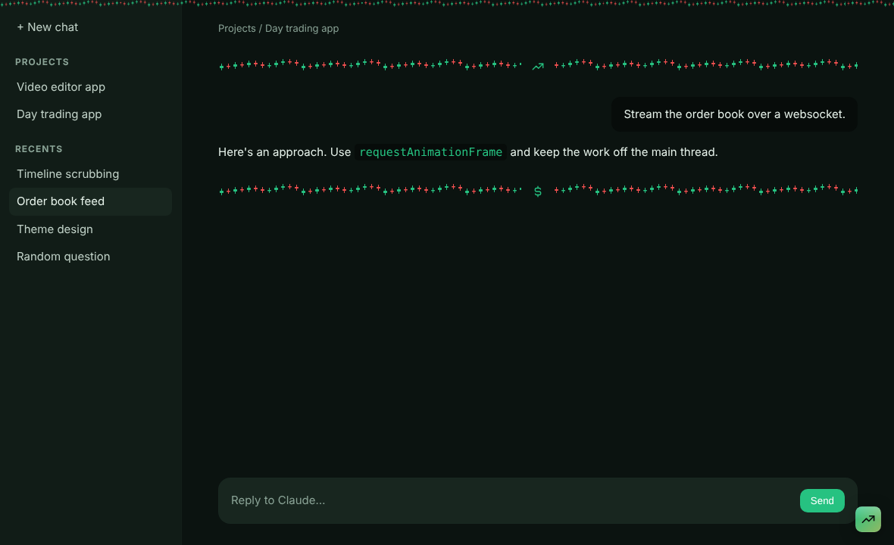
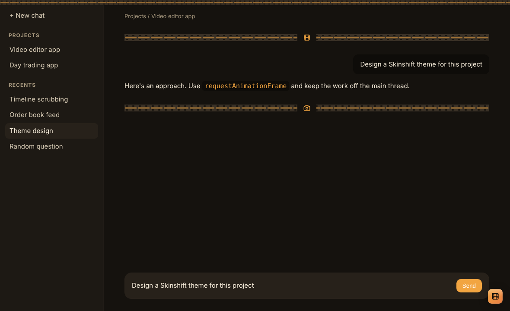
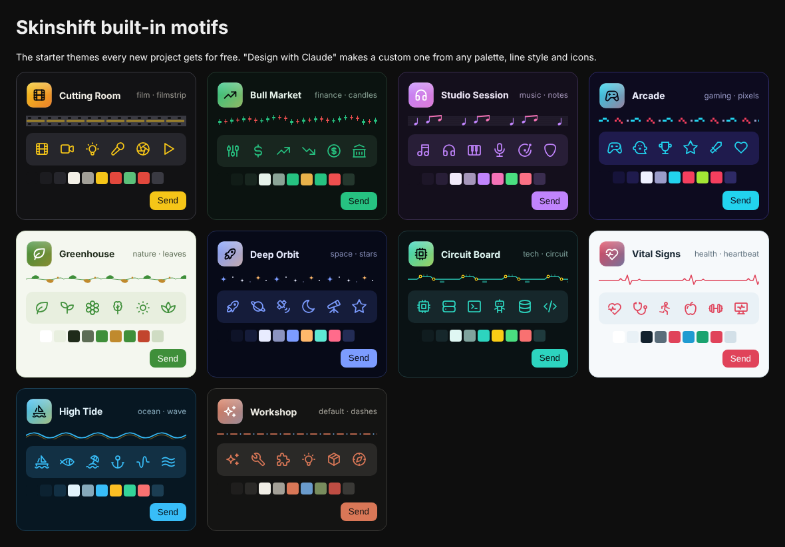

# Skinshift

Every Claude project gets its own look. Skinshift reads a project's first prompt, designs a theme for it (colors, a logo badge, a set of real icons, and a "line style" that replaces plain divider lines) and switches to it whenever you open a chat in that project.

**Free, no API keys.** Icons come from the bundled [Tabler](https://tabler.io/icons) set (MIT, about 4,800 icons, works offline). Custom designs come from Claude on the plan you already have.

Open a chat in **Video editor app** ("I want to build a software for video editing") and the app turns into a cutting room: film-strip dividers, a clapperboard badge, camera and lighting icons, a dark set with tungsten yellow. Switch to a chat in **Day trading app** and it becomes a trading floor: candlestick dividers, red and green, bulls, bears and dollar signs.

| Video editor app (starter theme) | Day trading app (starter theme) | Video editor app, designed by Claude |
| --- | --- | --- |
|  |  |  |

All the starter themes: 

*Screenshots are from the end-to-end test, which loads the real extension against a stand-in for claude.ai (`test/e2e/fake-claude.html`).*

> Skinshift is an independent community project. It is not made, endorsed or supported by Anthropic.

## What's in the repo

| Part | Themes | How it hooks in | Status |
| --- | --- | --- | --- |
| [`extension/`](extension) | claude.ai in Chrome, Edge, Brave, Arc | A Manifest V3 browser extension: content script + user stylesheet | Working, end-to-end tested |
| [`claude-code-plugin/`](claude-code-plugin) | Claude Code (terminal, and the desktop app's Code tab) | A Claude Code plugin: custom theme files, a themed band above the prompt, `/design` | Working, plugin-tested |
| [`desktop/`](desktop) | The Claude Desktop app's chat window | Patches the installed app to inject the same stylesheet | **Experimental, unofficial, Linux only.** Read [docs/desktop.md](docs/desktop.md) first |
| [`core/`](core) | | The shared theme engine: schema, generator, compilers | Unit-tested |
| [`cli/`](cli) | | `skinshift design "<idea>"` (via `claude -p`), `skinshift prompt`, `skinshift preview` | |

How the pieces fit, and what each one can and can't change, is in [docs/architecture.md](docs/architecture.md).

## Install

### Claude Code

At a Claude Code prompt:

```
/plugin install skinshift --marketplace ronyitzhaki98/skinshift
```

Answer `y` to add the marketplace, then pick a scope. From then on:

- The first real prompt you send in a project folder designs that project's theme in the background, writes it to `~/.claude/themes/skinshift-<name>.json` and switches `/theme` to it. Your previous theme is remembered.
- Opening Claude Code in another project switches to that project's theme, or back to your own theme if it has none.
- `/design <idea>` redesigns the theme from a description; `/design` alone redesigns from the first prompt; `/design show` prints it; `/design off` removes it for this project.
- A band above the prompt draws the project's line style (`▮▯▮▯` film strip, `┃╽│╿` candles, `∿∿∿` waves...) with its icons and name.

Themes are designed with the session's own model access (no extra API key). The model is a plugin option (`sonnet` by default) in `/config`.

### Browser extension (claude.ai)

1. Clone the repo, run `npm run build` (only needed after editing `core/`; the built files are committed).
2. Open `chrome://extensions`, turn on Developer mode, **Load unpacked**, pick the `extension/` folder.
Every project gets a starter theme right away, picked from its first prompt (see `docs/preview.html`). For a custom one, open the popup and press **Design with Claude**: it puts a design request in your chat (optionally with your own notes on the look), you press send, and when Claude replies with its ```` ```skinshift ```` block the project switches to that design. The popup can also turn the theme off for a project.

### Claude Desktop

See [docs/desktop.md](docs/desktop.md). In short: the desktop app has no theming or extension API, so the only route is patching the installed app. That is unsupported, breaks on every update and may conflict with Anthropic's terms, so it is opt-in and Linux-only for now.

## Develop

```
npm install
npm test            # core + desktop injector unit tests
npm run test:plugin # validate and test the Claude Code plugin (needs the claude CLI)
npm run test:e2e    # load the extension in Chromium against the claude.ai stand-in; writes docs/screenshots/
npm run preview     # docs/preview.html: every built-in motif
```

`core/` is the source of truth. `npm run build` copies it into `extension/core/` and `claude-code-plugin/hooks/core/`, because a browser extension and a Claude Code plugin can only load files inside their own folder.

### Adding a motif or line style

- A line style is one function in `core/patterns.js` that returns a tileable SVG strip, plus its terminal characters in `TERMINAL_LINES`.
- A motif is one entry in `core/motifs.js`: keywords, palette, line style, Tabler icon names, logo icon.
- `npm run build:icons` refreshes the bundled icon pack from `@tabler/icons`.

The model is told the list of both, so a new one is available to designed themes immediately.

## License

MIT
